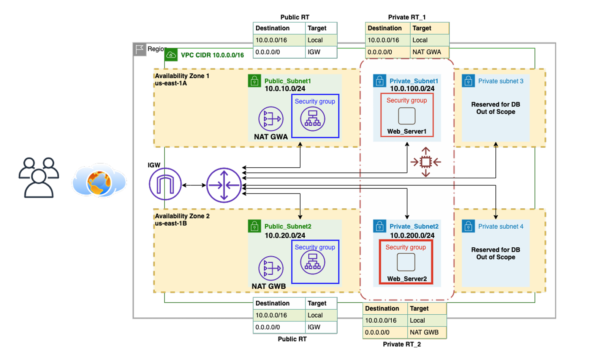
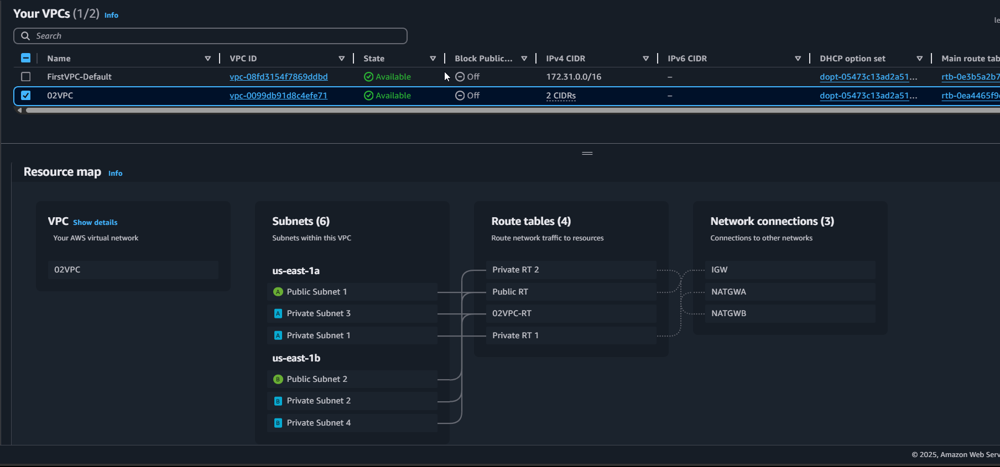
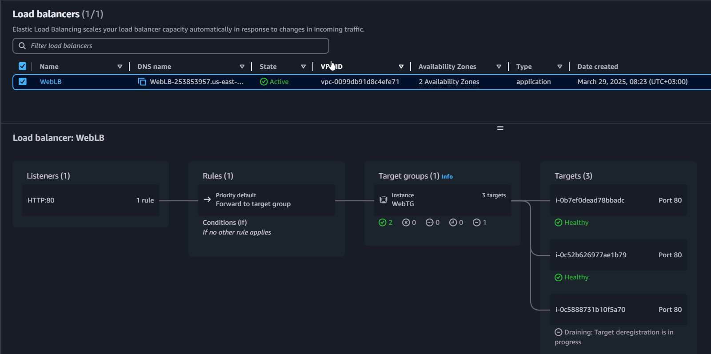
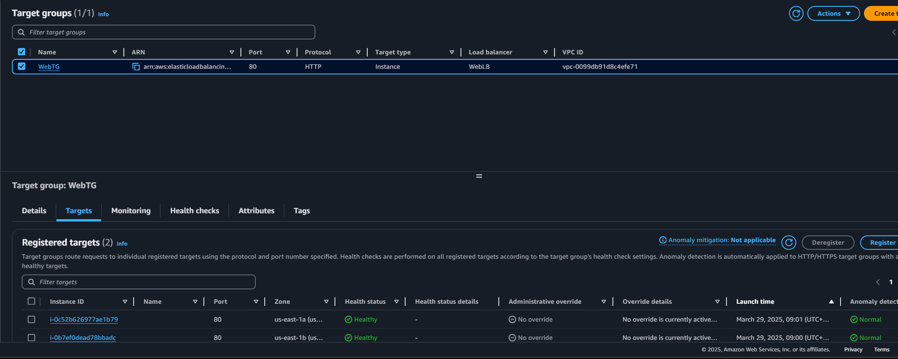
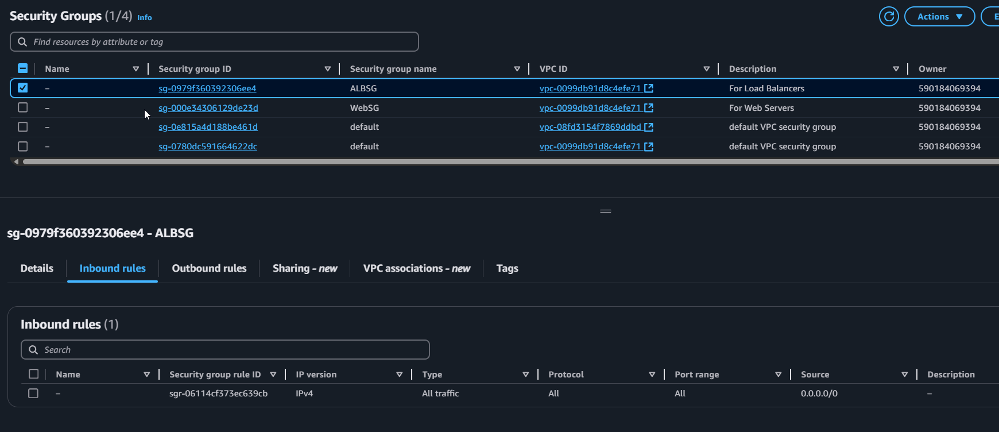
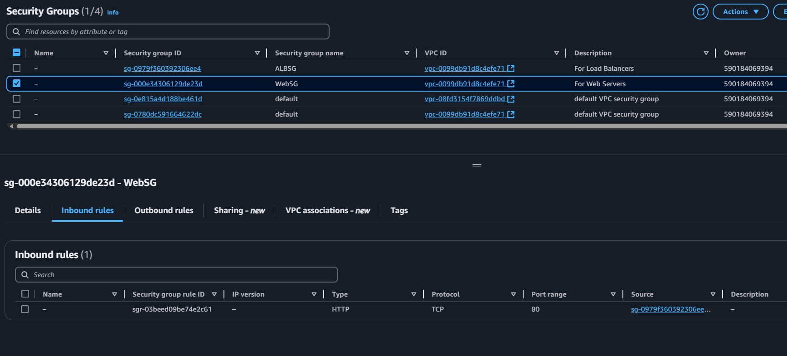
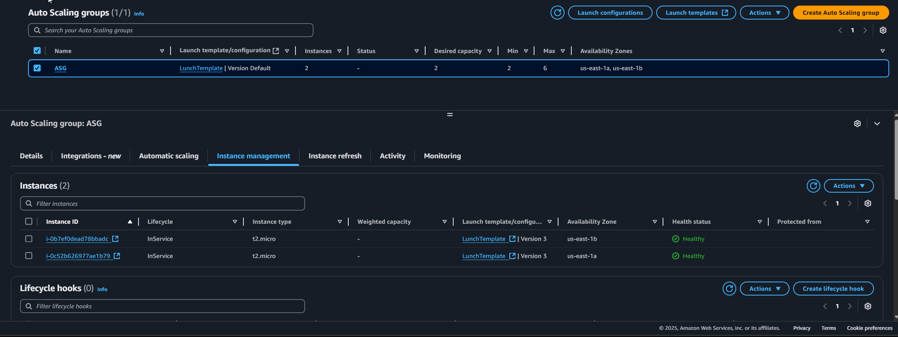
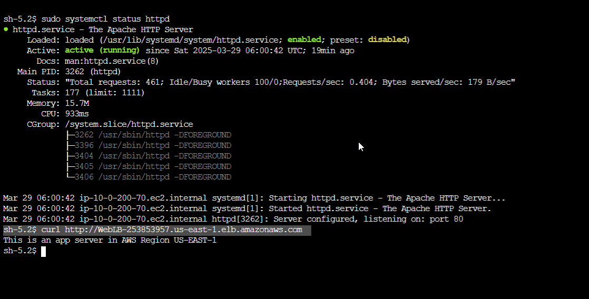

# AWS Capstone Project - Multi-Tier Web Application

This repository presents a comprehensive **Infrastructure-as-a-Service (IaaS)** deployment on AWS to host a **highly available**, **scalable**, and **secure** multi-tier web application, following AWS best practices. The entire setup was built **manually using the AWS Console**, making it ideal for educational and portfolio purposes.

---

## Architecture Overview

The architecture is spread across multiple **Availability Zones (AZs)** in the `us-east-1` region and consists of public and private subnets, enabling fault tolerance and high availability. The private subnets host web servers, while the public subnets are responsible for NAT Gateways and the Application Load Balancer.



---

## Infrastructure Components

- VPC with CIDR `10.0.0.0/16`
- 4 Subnets:
  - 2 Public subnets for NAT Gateways and Load Balancer
  - 2 Private subnets for EC2 Web Servers
- Internet Gateway for external access
- NAT Gateways in each public subnet
- Route Tables for proper traffic routing
- EC2 Instances with Apache Web Server
- User Data Script for EC2 auto configuration
- Application Load Balancer (ALB) for traffic distribution
- Target Group linked to the EC2 instances
- Auto Scaling Group using Launch Template
- IAM Role for secure SSM access
- Security Groups with least-privilege rules

---

## Detailed Infrastructure Screenshots

### VPC and Subnets
Illustrates the creation of public and private subnets across AZs.  


### Application Load Balancer
Load Balancer that distributes traffic to EC2 instances in private subnets.  


### Target Group
Target Group linked to EC2 instances, receiving traffic from the ALB.  


### ALB Security Group
Restricts inbound access to the ALB, typically only allowing HTTP/HTTPS.  


### Web Server Security Group
Only allows inbound traffic from the ALB Security Group.  


### Auto Scaling Group
Monitors and maintains instance count based on target metrics.  


### Server Response
Shows the response from the web server after successful deployment.  


---

## EC2 User Data Script

Used to automatically install Apache and serve a simple HTML page upon instance creation:

```bash
#!/bin/bash
yum update -y
yum install httpd -y
systemctl start httpd
systemctl enable httpd
echo "This is an app server in AWS Region US-EAST-1" > /var/www/html/index.html
```

---

## Security Best Practices

- EC2 Instances in private subnets with no public IPs
- Internet access via NAT Gateways only
- Only ALB is publicly accessible
- Use of IAM Roles for EC2 (no static credentials)
- EC2 access via AWS SSM Session Manager, not SSH

---

## Notes

- Region: `us-east-1`
- EC2 Type: `t2.micro` (Free Tier)
- OS: Amazon Linux 2023
- Method: 100% Manual using AWS Console

---

## Key Takeaways

- Solid understanding of AWS networking
- Practical skills in setting up fault-tolerant, scalable infrastructure
- Manual deployment reinforces foundational AWS knowledge
- Ideal for cloud portfolio or DevOps interview discussions

---

## Author

Made by [@abdlrhmanfahd](https://github.com/abdlrhmanfahd)
